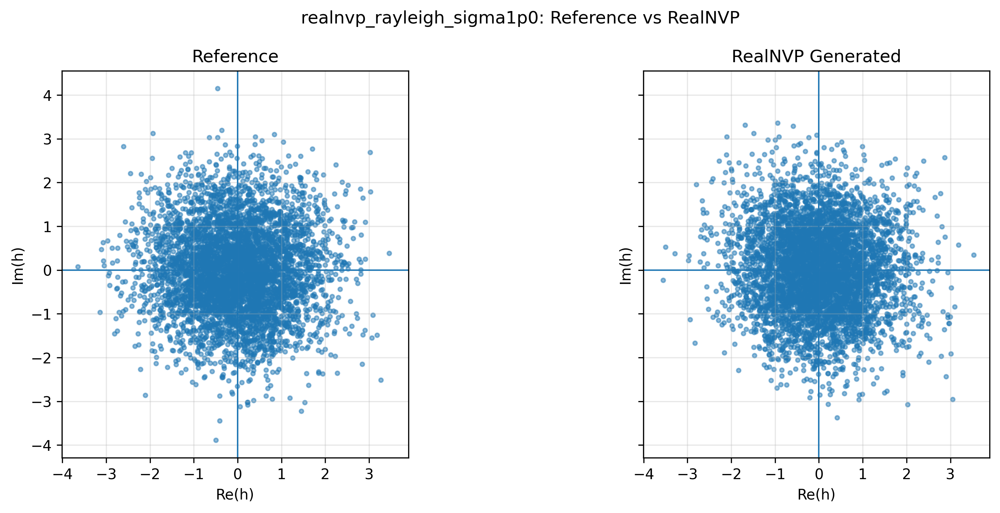
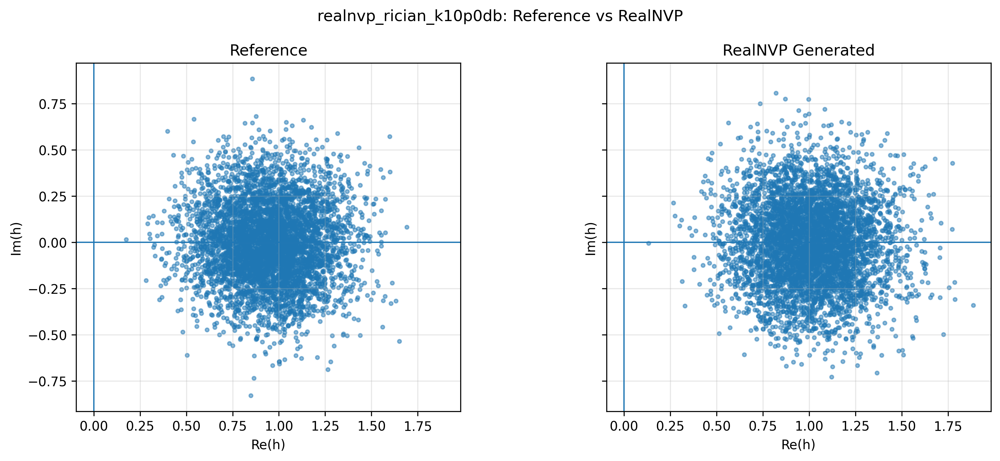
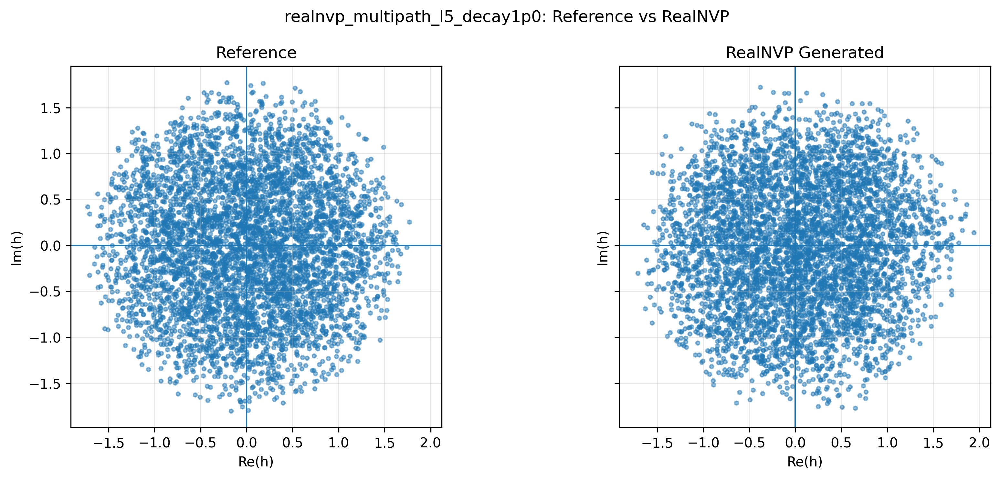

# RealNVP Channel Modeling Comparison

## 1. Overview

This report compares RealNVP density modeling results across three scalar complex wireless channel models:

1. Rayleigh fading
2. Rician fading
3. Multipath fading

The objective is to evaluate whether one RealNVP architecture can learn different wireless channel coefficient distributions.

The target density is:

$$
p(h)
$$

where the complex wireless channel coefficient is:

$$
h = h_{\mathrm{real}} + jh_{\mathrm{imag}}
$$

For PyTorch-based modeling, each complex coefficient is represented as:

$$
x = [\mathrm{Re}(h), \mathrm{Im}(h)]
$$

Therefore, the model learns:

$$
p(x)
$$

---

## 2. Compared Channel Models

### 2.1 Rayleigh Fading

Rayleigh fading assumes no dominant line-of-sight component.

The real and imaginary parts are modeled as independent Gaussian random variables:

$$
h_{\mathrm{real}} \sim \mathcal{N}(0, \sigma^2)
$$

$$
h_{\mathrm{imag}} \sim \mathcal{N}(0, \sigma^2)
$$

For this experiment:

$$
\sigma = 1.0
$$

Therefore:

$$
x = [\mathrm{Re}(h), \mathrm{Im}(h)] \sim \mathcal{N}(0,I)
$$

Expected behavior:

- circular scatter plot,
- centered around zero,
- average channel power close to 2,
- theoretical NLL close to 2.8379.

---

### 2.2 Rician Fading

Rician fading assumes a deterministic line-of-sight component plus scattered components.

The normalized channel is:

$$
h = \sqrt{\frac{K}{K+1}}h_{\mathrm{LOS}} + \sqrt{\frac{1}{K+1}}h_{\mathrm{NLOS}}
$$

where:

- $K$ is the Rician K-factor,
- $h_{\mathrm{LOS}}$ is the line-of-sight component,
- $h_{\mathrm{NLOS}}$ is the non-line-of-sight scattering component.

In this comparison, the default experiment uses:

$$
K_{\mathrm{dB}} = 10
$$

Expected behavior:

- scatter plot shifted toward the positive real axis,
- average channel power close to 1 because of normalization,
- generated samples should preserve the LOS-induced shift.

---

### 2.3 Multipath Fading

The multipath simulator creates a flat-fading equivalent channel by summing multiple complex paths:

$$
h = \sum_{\ell=1}^{L} \alpha_{\ell}
$$

Each path gain is:

$$
\alpha_{\ell} = a_{\ell}e^{j\phi_{\ell}}
$$

where:

- $a_{\ell}$ is the path amplitude,
- $\phi_{\ell}$ is the path phase,
- $L$ is the number of paths.

The default comparison uses:

$$
L = 5
$$

and an exponential power decay factor:

$$
\lambda = 1.0
$$

Expected behavior:

- distribution centered near zero if no LOS component is added,
- average channel power close to 1 because of normalization,
- distribution shape depends on number of paths and decay factor.

---

## 3. Experiment Commands

Run all experiments from the repository root.

### Rayleigh

```bash
python3 scripts/train_realnvp_channel.py \
  --channel rayleigh \
  --sigma 1.0 \
  --epochs 100
```

### Rician

```bash
python3 scripts/train_realnvp_channel.py \
  --channel rician \
  --k-factor-db 10 \
  --epochs 100
```

### Multipath

```bash
python3 scripts/train_realnvp_channel.py \
  --channel multipath \
  --num-paths 5 \
  --decay-factor 1.0 \
  --epochs 100
```

---

## 4. Result Files

The experiment script saves metrics under:

```text
results/metrics/
```

Expected metric files:

```text
results/metrics/realnvp_rayleigh_sigma1p0_metrics.json
results/metrics/realnvp_rician_k10p0db_metrics.json
results/metrics/realnvp_multipath_l5_decay1p0_metrics.json
```

The script also saves plots under:

```text
results/figures/
```

Expected comparison plots:

```text
results/figures/realnvp_rayleigh_sigma1p0_comparison.png
results/figures/realnvp_rician_k10p0db_comparison.png
results/figures/realnvp_multipath_l5_decay1p0_comparison.png
```

For GitHub documentation, copy selected plots into:

```text
docs/assets/
```

---

## 5. Quantitative Results

Replace the placeholder values after running the experiments.

| Channel | Test NLL | Best Val NLL | Reference Power | Generated Power | Reference Mean | Generated Mean |
|---|---:|---:|---:|---:|---|---|
| Rayleigh | 2.8879 | 2.8853 | 2.0189 | 1.9414 | -0.0102 | 0.0165 |
| Rician, K = 10 dB | -0.2002 | -0.2056 | 0.9967 | 1.0163 | 0.9512 | 1.01003 |
| Multipath, L = 5 | 2.0991 | 2.0975 | 1.0000 | 0.9887 | -0.0012 | 0.0491 |

---

## 6. Sample Statistics

### Rayleigh

| Statistic | Reference | Generated |
|---|---:|---:|
| Mean real | -0.0102 | 0.0165 |
| Mean imaginary | 0.0203 | 0.0162 |
| Std real | 1.0062 | 0.9581 |
| Std imaginary | 1.0028 | 1.0113 |
| Average power | 2.0189 | 1.9413 |

### Rician, K = 10 dB

| Statistic | Reference | Generated |
|---|---:|---:|
| Mean real | 0.9512 | 1.0100 |
| Mean imaginary | 0.0043 | -0.0033 |
| Std real | 0.2145 | 0.2232 |
| Std imaginary | 0.2138 | 0.2291 |
| Average power | 0.9966 | 1.1225 |

### Multipath, L = 5

| Statistic | Reference | Generated |
|---|---:|---:|
| Mean real | -0.0012 | 0.0491 |
| Mean imaginary | -0.0075 | -0.0154 |
| Std real | 0.7079 | 0.7128 |
| Std imaginary | 0.7062 | 0.6913 |
| Average power | 1.0 | 0.9887 |

---

## 7. Visual Results

### Rayleigh

Expected result: circular cloud centered around zero.



---

### Rician

Expected result: shifted cloud due to line-of-sight component.



---

### Multipath

Expected result: normalized multipath distribution with structure depending on path count and decay.



---

## 8. Interpretation

A successful RealNVP model should satisfy the following conditions:

1. The generated samples visually resemble the reference channel samples.
2. The generated average power is close to the reference average power.
3. The generated mean and standard deviation are close to the reference values.
4. The test NLL is finite and stable.
5. The training and validation NLL curves do not show divergence.

### Rayleigh Interpretation

Rayleigh fading is the simplest case in this project because the target distribution is Gaussian in the real-imaginary plane.

A well-trained RealNVP should produce:

- test NLL near 2.8379,
- mean close to zero,
- standard deviation close to 1 in both dimensions,
- average power close to 2.

### Rician Interpretation

Rician fading tests whether RealNVP can learn a shifted density caused by a line-of-sight path.

A good result should show:

- generated real mean close to reference real mean,
- generated imaginary mean close to zero for LOS phase 0,
- generated average power close to 1,
- visually similar shifted scatter cloud.

### Multipath Interpretation

Multipath fading tests whether RealNVP can learn a distribution produced by explicit path summation.

A good result should show:

- generated average power close to 1,
- generated scatter plot similar to reference,
- reasonable match in real and imaginary standard deviations.

---

## 9. Limitations

Current limitations:

1. All experiments use scalar complex channels.
2. The current multipath model is flat fading, not frequency selective.
3. The comparison uses only RealNVP.
4. The report currently uses likelihood and basic statistics only.
5. Distribution-distance metrics such as MMD or Wasserstein distance are not yet included.
6. No MIMO channel matrices are modeled yet.

---

## 10. Next Steps

Recommended next steps:

1. Add automatic aggregation from metrics JSON files.
2. Add learning-curve plots.
3. Add distribution-distance metrics.
4. Implement MAF.
5. Implement NSF.
6. Compare RealNVP, MAF, and NSF.
7. Extend the channel representation to simple MIMO samples.

---

## 11. Summary

This comparison evaluates whether RealNVP can model multiple wireless channel distributions using the same modular training and evaluation pipeline.

The expected outcome is:

- Rayleigh: RealNVP learns the Gaussian baseline.
- Rician: RealNVP learns the LOS-shifted channel distribution.
- Multipath: RealNVP learns the normalized random-path channel distribution.

This strengthens the repository by showing that the pipeline is reusable across different wireless communication scenarios.
EOF